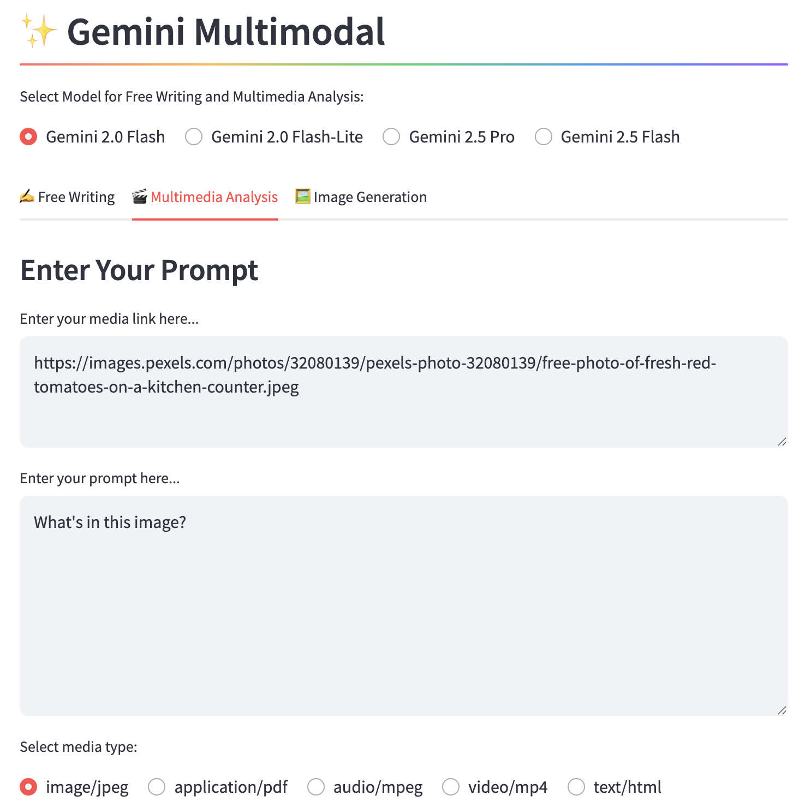

# Gemini-Streamlit-Cloudrun
A repository to explore Gemini GenAI models through building the following functionalities:

1. A conversational chatbot with history
2. A free style writing assistant
3. A multimedia analysis tool capable of handling **image, pdf, audio, video and webpage**
4. An image generation tool

### Sample app

### Technologies used:
- [Google Gen AI SDK](https://googleapis.github.io/python-genai/index.html)
- [Streamlit](https://docs.streamlit.io/)
- [Docker](https://www.docker.com/)
- [GCP Cloud Run](https://cloud.google.com/run?hl=en)

### Referenced from:
- [Gemini Sample Apps](https://github.com/GoogleCloudPlatform/generative-ai/tree/main/gemini/sample-apps/gemini-streamlit-cloudrun)
- [Gemini Sample Notebooks](https://github.com/GoogleCloudPlatform/generative-ai/tree/main/gemini/getting-started)

